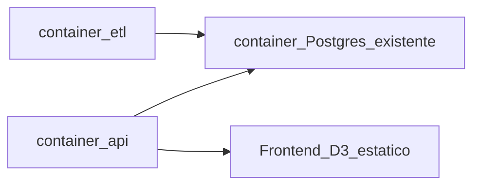

# Dashboard de ventas con ML

Repo vacío. Stack cerrado: **PostgreSQL (existente) → Pandas/Scikit-learn → FastAPI → D3.js**. UI en español. Datos sintéticos estilo Superstore (seed fijo, sin Kaggle) con 24 meses de ventas, categorías, tiendas/regiones, promociones y festivos.

## Restricción: cero runtime en el host

Nada se instala ni ejecuta en la PC local: no Python, no pip/venv, no Postgres nuevo, no `python -m etl.*` en el host.

- Todo corre en **contenedores Docker** (API, ETL/ML, frontend estático).
- La base de datos es el **servidor PostgreSQL que ya tienes en Docker**. Este compose **no** levanta otro Postgres.
- Dependencias Python solo dentro de la imagen (`Dockerfile` + `requirements.txt`).
- Arranque, carga, entrenamiento y re-train: únicamente `docker compose ...`.

Conexión al Postgres existente:

- Unirse a su **red Docker** (`networks: external`).
- Host = nombre del contenedor Postgres (DNS interno), no `localhost`.
- Credenciales y red en [`.env`](.env) (plantilla [`.env.example`](.env.example)): `POSTGRES_HOST`, `POSTGRES_PORT`, `POSTGRES_USER`, `POSTGRES_PASSWORD`, `POSTGRES_DB`, `POSTGRES_DOCKER_NETWORK`.
- Crear/usar la base `analisis_mercado` desde el contenedor ETL (no tocar otras DBs).

## Arquitectura

Servicios Compose (solo estos dos):

- `etl`: one-shot — aplica `schema.sql`, genera/carga datos, entrena, escribe `predictions`.
- `api`: FastAPI + estáticos D3 en `/`.

Ambos en la red externa del Postgres. Un `Dockerfile` común, `CMD` distinto.

## Datos y schema

[`db/schema.sql`](db/schema.sql):

- `stores`: id, name, region, lat, lon
- `products`: id, name, category
- `sales`: date, store_id, product_id, qty, revenue, promo (bool)
- `holidays`: date, name
- `predictions`: date, y_true (nullable en futuro), y_pred, horizon

[`etl/generate_data.py`](etl/generate_data.py) crea ~8 tiendas (4 regiones CO/LATAM o ES), ~40 productos (5 categorías), estacionalidad, weekends, promociones y ruido. [`etl/load.py`](etl/load.py) carga a Postgres **desde el contenedor**.

## Modelo

[`etl/features.py`](etl/features.py) + [`etl/train.py`](etl/train.py), ejecutados en el contenedor `etl`:

- Agregar ventas diarias.
- Features: `dow`, `month`, `is_weekend`, `is_holiday`, `promo_rate`, `lag_7`, `lag_28`, `rolling_mean_7`.
- `RandomForestRegressor`, split temporal (train hasta T, test últimos 60 días).
- Guardar R² / MAE / MAPE en `model_metrics`.
- Pronóstico recursivo 7/15/30 días → `predictions`.

## API

[`api/main.py`](api/main.py) (FastAPI + psycopg):

- `GET /api/kpis` — ventas totales, YoY, ticket medio
- `GET /api/sales/trend` — real vs predicho
- `GET /api/forecast?horizon=7|15|30`
- `GET /api/sales/by-category`
- `GET /api/sales/by-region`
- `GET /api/promos/impact` — media/lift promo vs no-promo
- `GET /api/model/metrics`

## Frontend (2 pantallas)

[`frontend/index.html`](frontend/index.html) — Resumen ejecutivo: 3 KPIs, línea real vs predicho, selector 7/15/30 + área de forecast.

[`frontend/analisis.html`](frontend/analisis.html) — Categorías (barras), mapa burbuja D3 (`lat`/`lon` por tienda), impacto promo (barras o box).

JS en [`frontend/js/`](frontend/js/): `api.js`, `resumen.js`, `analisis.js`. Sin framework.

## Arranque (solo Docker)

1. Copiar `.env.example` → `.env` y rellenar red/host/credenciales del Postgres ya levantado.
2. Init + train: `docker compose run --rm etl`
3. Dashboard: `docker compose up --build api`

Re-entrenar: otra vez `docker compose run --rm etl`.

[`README.md`](README.md): cómo hallar la red (`docker inspect` del contenedor Postgres), variables de `.env`, y qué muestra cada pantalla.

## Tareas

- [ ] Dockerfile + docker-compose (api + etl; red externa; sin servicio Postgres) + schema.sql + requirements.txt + .env.example
- [ ] Generar datos sintéticos Superstore y cargarlos a PostgreSQL **desde el contenedor etl**
- [ ] Features, RandomForestRegressor, métricas y forecasts 7/15/30 **en el contenedor etl**
- [ ] FastAPI en contenedor: kpis, trend, forecast, category, region, promos, metrics
- [ ] D3: resumen ejecutivo + página de análisis (categoría, mapa, promo)
- [ ] README: solo comandos Docker; cómo conectar al Postgres existente

## Fuera de alcance

Power BI/Tableau, Airflow, auth, multi-usuario, instalar Python/Postgres en el host, segundo contenedor Postgres.
